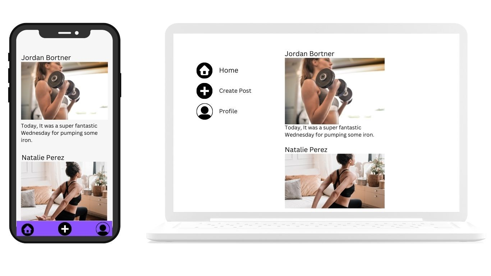
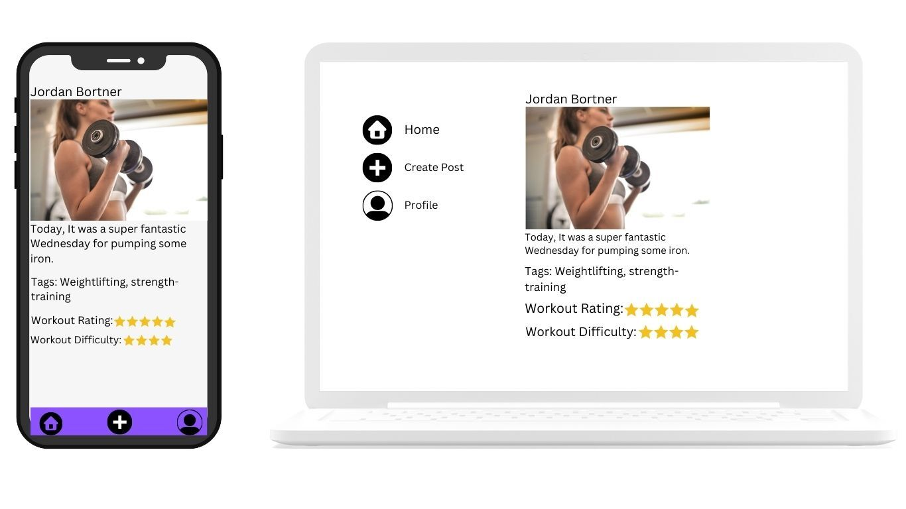
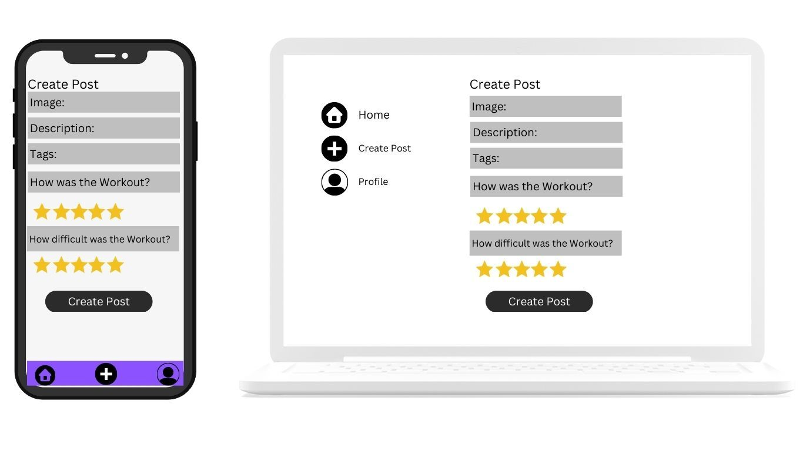
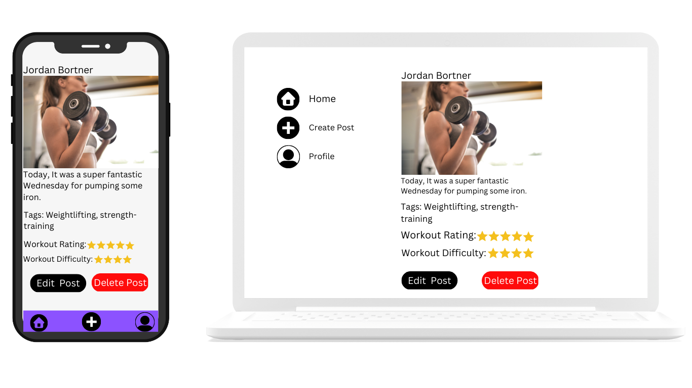
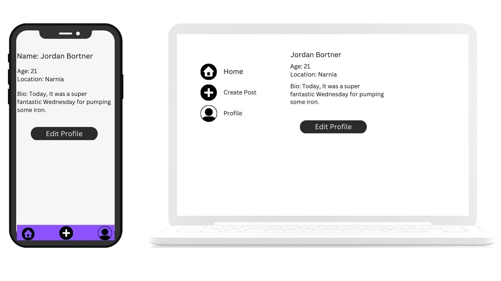
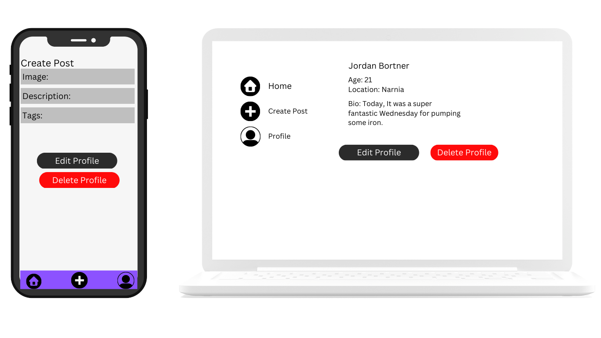

# Fitness Accountability App

## App Features:
- Create Profile
- Update/Edit Profile
- Delete Profile (?)
- Create Post
- Update/Edit Post
- Delete Post

### Stretch Goals:
- Ability to like posts 
- Ability to comment on posts
- Follow/Unfollow people
- Display number of followers
- Remove followers
- Username

 

## Responsibilities:

### Documentation / Project Management: 
- Natalie

### Front-End:
- Mary
### Back-End:
- Jordan

### Styling:
- Natalie

### Git Flow/Version Control:
- Jordan

 

## Wireframe Images:

 

## User Story:

User opens app and lands on the Homepage, which is a feed of posts. Underneath each post is the text and a space to write and post a comment.

There is a nav bar at the bottom with menu items: 
- Profile
- Post

When the user clicks on profile, they should see their own data:
- Name
- Bio
- Age
- Location

There is an edit button on the profile page.

When the user clicks on 'post' in the nav bar, they'll see a page with a form where they can input their post data:
- Image (upload or link)
- Text
- Tags
- How did this workout go? (1-5)
- How difficult was this workout? (1-5)

When they have input their data, they'll click 'post' to share their post.

User can edit or delete a post by clicking into the post and selecting 'edit' or 'delete'.

When a user clicks on a post in their feed, it opens up and shows the detail page, including the tags and the workout ratings.

 

## User Flow Map:

 

## ERD:

